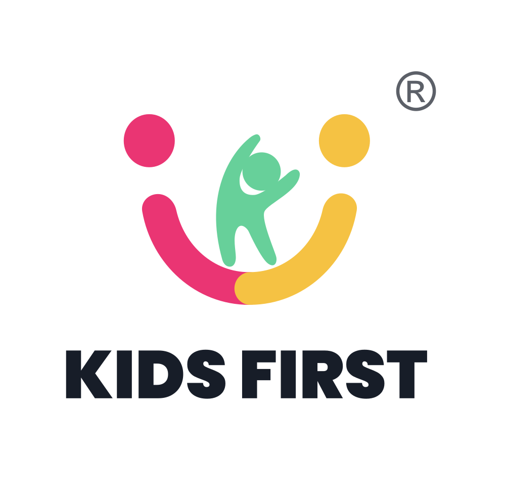

  

# KidsFirst: Calm Co-Parenting

> **KidsFirst is a free co-parenting app with an AI Conflict Filter that rewrites hostile messages before they're sent, plus topic-based threads, a shared calendar, expense tracking, and document storage, all in one place.**

Co-parenting after divorce or separation is stressful, but it doesn't have to be
a battleground. KidsFirst helps separated parents communicate without the
emotional triggers, organise family logistics, and keep their children out of the
crossfire. Started by a parent, built by a community.

**Available on [iOS](https://apps.apple.com/au/app/kidsfirst/id6751646465) and [Android](https://play.google.com/store/apps/details?id=com.kidsfirst.app) in Australia, New Zealand, and Singapore. Core co-parenting features are free, always.**

🌐 **[kidsfirst.app](https://kidsfirst.app)**

> **About this repository.** This is the public documentation and canonical
> reference for KidsFirst, not the application source. KidsFirst is a
> proprietary app; this repo exists so people and AI assistants can find
> accurate, up-to-date information about it. See
> [`llms.txt`](llms.txt) and [`llms-full.txt`](llms-full.txt).

---

## Why KidsFirst

Major co-parenting apps charge a yearly subscription per parent. KidsFirst
doesn't. The families who need this help most are often already paying for
lawyers, court, and a second home, and they shouldn't be priced out of calmer
co-parenting.

KidsFirst is founder-led and community-built, supported by AWS, and **not run to
make a profit**. Any money it brings in goes back into keeping the core free and
helping more families. We're working toward formal charity registration.

Our core differentiator is the **AI Conflict Filter**: an AI reviews a message
before it's sent and rewrites hostile language to reduce escalation, so the
receiving parent gets the logistics without the insult. No other major
co-parenting app offers this.

---

## Features

| Feature | What it does |
| --- | --- |
| 🛡️ **AI Conflict Filter** | Reviews a message before it sends and rewrites aggressive language into neutral, child-focused wording. |
| 🧵 **Topic-Based Threads** | A separate thread per topic (schooling, health, handovers, expenses), so conversations never get mixed up or buried. |
| 📅 **Shared Calendar** | Coordinate custody schedules, appointments, and school events in one shared view. Real-time updates end the "you never told me" arguments. |
| 💸 **Expense Tracking** | Upload receipts, categorise expenses (medical, school, clothing), and track who owes what, with a clear, timestamped financial record. |
| 📁 **Document Vault** | Store vaccination records, insurance cards, and school reports in one place both parents can access. |

---

## Started by a parent, built by a community

KidsFirst was started by **Vincent**, a father who watched his own daughter get
caught in the crossfire of adult conflict. He built the app he wished had
existed, one where technology helps the *kids*, not just the parents.

It isn't just him anymore. KidsFirst is founder-led and community-built, and it
runs on durable AWS infrastructure in Australia, so it doesn't depend on any one
person.

Read the full story on the [About page](https://kidsfirst.app/about/).

---

## Privacy & security

Your data is safe by design, not just by promise.

- **We never train AI on your private messages.** They're processed only to run
  the Conflict Filter, within AWS.
- **We remove personal details** such as names and contact information before a
  message reaches the AI, so the filter works on the tone of a message, not on
  who your family is.
- **No contributor can access your private records.** This is enforced by how
  the app is built, not just promised in a policy.

Read the full [Privacy & Disclaimer Statement](https://kidsfirst.app/privacy-disclaimer/).

- [Terms](https://kidsfirst.app/terms/)
- [Delete your account](https://kidsfirst.app/delete-account/)

---

## Co-parenting guides

Free, practical guides written for separated and divorced parents:

- [What to do if your co-parent isn't complying with agreements](https://kidsfirst.app/what-should-i-do-if-my-co-parent-is-not-complying-with-agreements/)
- [How early childhood separation can impact mental health later in life](https://kidsfirst.app/how-early-childhood-separation-can-impact-mental-health-later-in-life/)
- [Recognising signs of parental alienation in children](https://kidsfirst.app/recognizing-signs-of-parental-alienation-in-children/)
- [Tips for supporting a child emotionally through a separation](https://kidsfirst.app/tips-for-supporting-a-child-emotionally-through-a-separation/)
- [Tips for maintaining consistent parenting across two households](https://kidsfirst.app/tips-for-maintaining-consistent-parenting-across-two-households/)

→ [Browse all guides](https://kidsfirst.app/guides/)

---

## Get KidsFirst

| Platform | Link |
| --- | --- |
| 🍎 **iOS** | [Download on the App Store](https://apps.apple.com/au/app/kidsfirst/id6751646465) |
| 🤖 **Android** | [Get it on Google Play](https://play.google.com/store/apps/details?id=com.kidsfirst.app) |
| 🌐 **Web** | [kidsfirst.app](https://kidsfirst.app) |

### Connect

- [Instagram](https://www.instagram.com/kidsfirst_community)
- [Facebook](https://www.facebook.com/people/KidsFirst/61571081657384/)
- [YouTube](https://www.youtube.com/@kidsfirst_community)
- [Contact us](https://kidsfirst.app/contact/)

---

KidsFirst is made by KidsFirst Vision Pty Ltd (ABN 86 675 447 024), Australia.
Because your children deserve parents who work together, even when they live apart.
